# Simulation Guide

## Contents

1. [What this tool does](#1-what-this-tool-does)
2. [Signal chain](#2-signal-chain)
3. [Getting started](#3-getting-started)
4. [Source files](#4-source-files)
5. [Configuration reference](#5-configuration-reference)
6. [Output files](#6-output-files)
7. [Example results](#7-example-results)
8. [Sweep mode](#8-sweep-mode)
9. [Implementation loss](#9-implementation-loss)
10. [Adding or modifying carriers](#10-adding-or-modifying-carriers)
11. [GUI](#11-gui)
12. [Test suite](#12-test-suite)
13. [Simulation overview](simulation_overview.md) — full execution flow, all three optional paths, and output files produced by each
14. [Memory scaling](memory_scaling.md) — filter cost, FFT buffer sizing, OLA efficiency vs symbol rate ratio
15. [Filter analysis](filter_analysis.md) — filter size justification, upsampling fidelity, IMD rejection adequacy
16. [Toolchain](toolchain.md) — correct invocations for pytest/pyright/ruff, Windows Store Python stub, pyrightconfig.json
17. [Channel impairment model](channel_impairment.md) — transfer function, band-edge behaviour, baseband-equivalent representation, cross-carrier limitation
18. [MSK modulation](msk_modulation.md) — why MSK uses a matched-filter (offset-QPSK) demodulator rather than a Viterbi decoder, and why it attains the BPSK error rate
19. [Synchronization](synchronization.md) — why timing and carrier recovery are genie-aided by design, and the blind alternatives that were considered

---

## 1. What this tool does

This simulation models a satellite or RF ground-station scenario where multiple
carriers — potentially at very different symbol rates and modulations — share a single
power amplifier. It lets you answer questions like:

- How much intermodulation distortion (IMD) does the amplifier inject into each
  carrier at a given input backoff?
- What is the carrier-to-interference ratio (CIR) and how does it compare to the
  carrier-to-noise ratio (CNR)?
- At what IBO does BER become unacceptable for each carrier?
- How does a passband channel impairment (amplitude ripple, phase nonlinearity)
  interact with the NL distortion?
- How do EVM and BER track across a 2-D sweep of IBO and noise density?
- **How much implementation loss does the nonlinear environment impose on each carrier
  relative to ideal AWGN theory?**

The simulation is fully deterministic (fixed seed), TOML-configured, and produces
both console tables and PNG/markdown outputs. No code changes are needed to explore new
operating points.

---

## 2. Signal chain

```mermaid
flowchart LR
    subgraph TX["Per carrier  —  native rate = sps × symbol_rate"]
        direction TB
        S["Random symbols<br/>BPSK · DBPSK · MSK · QPSK · OQPSK<br/>8PSK · 16QAM · 16APSK · 32APSK"]
        RRC_TX["RRC transmit filter<br/>baseband.py"]
        CHIMP["Channel impairment — optional<br/>filters.py<br/>amplitude ripple · phase nonlinearity"]
        UPSMPL["OLA upsample to wideband rate<br/>filters.py"]
        FSHIFT["Frequency-shift to carrier centre freq<br/>Scale by carrier power_db"]
        S --> RRC_TX --> CHIMP --> UPSMPL --> FSHIFT
    end

    subgraph WB["Composite  —  wideband sample rate"]
        direction TB
        SUM["Σ  Sum all enabled carriers"]
        NORM["Normalise to unit RMS<br/>(analytical, seed-independent)<br/>apply input backoff"]
        NLA["Nonlinear amplifier<br/>AM-AM + AM-PM<br/>nonlinear_amplifier.py"]
        AWGN["Add wideband AWGN<br/>after amp · satellite downlink model"]
        SUM --> NORM --> NLA --> AWGN
    end

    subgraph RX["Per carrier  —  extraction and receive  (if sweep_demod = true)"]
        direction TB
        DCNV["Downconvert<br/>exp(-j 2π f_c t)"]
        DNSMPL["OLA downsample to native rate<br/>filters.py · Kaiser sinc ≈80 dB"]
        MF["RRC matched filter<br/>receiver.py"]
        SSAMP["Symbol sampling<br/>1 sample per symbol"]
        HDEC["Hard decisions<br/>phase-ambiguity resolution → BER"]
        MTRX["Metrics: EVM · CNR · CIR · CNIR<br/>simulation.py / receiver.py"]
        DCNV --> DNSMPL --> MF --> SSAMP --> HDEC --> MTRX
    end

    FSHIFT --> SUM
    AWGN --> DCNV

    classDef tx fill:#dbeafe,stroke:#3b82f6,color:#1e3a8a
    classDef wb fill:#fef3c7,stroke:#f59e0b,color:#78350f
    classDef rx fill:#dcfce7,stroke:#22c55e,color:#14532d

    class S,RRC_TX,CHIMP,UPSMPL,FSHIFT tx
    class SUM,NORM,NLA,AWGN wb
    class DCNV,DNSMPL,MF,SSAMP,HDEC,MTRX rx
```



### AWGN placement

AWGN is added after the nonlinear amplifier. This models a single-hop satellite
downlink where thermal noise is primarily at the receiver. The uplink noise
contribution (retransmitted by the transponder) is handled as a separate link budget
item using the reciprocal sum:

```
1/(C/N)_total = 1/(C/N)_UL + 1/(C/N)_DL + 1/(C/N)_IM
```

Placing noise before the amp would couple the noise level to the IM products,
making the noise-vs-distortion trade-off analysis ill-conditioned.

### CNR / CIR / CNIR computation

Three OLA downsampling extractions per carrier: pre-NL reference, post-NL noiseless,
post-NL+noise. A complex projection separates the deterministic AM-AM/AM-PM effect
from residual in-band IM distortion:

```
α          = ⟨bb_rx, nl_pure⟩ / ⟨bb_rx, bb_rx⟩   (complex gain of desired component)
signal     = α · bb_rx                              (desired part of nl_pure)
distortion = nl_pure − signal                       (true IM products)
noise      = nl_noisy − nl_pure                     (additive noise)

CIR  (dB)  = 10 log₁₀( P_signal / P_distortion )
CNR  (dB)  = 10 log₁₀( P_signal / P_noise )
CNIR (dB)  = 10 log₁₀( P_signal / (P_distortion + P_noise) )
```

This correctly attributes AM-AM compression as a gain change rather than distortion,
and is independent of absolute amplitude scaling.

---

## 3. Getting started

### Prerequisites

- [uv](https://github.com/astral-sh/uv) installed (handles Python version and packages)
- Git (to clone the repo)

### Step 1 — Clone and install

```powershell
git clone https://github.com/bandospook/signal-processing-simulation.git
cd signal-processing-simulation
uv sync          # creates .venv and installs numpy + matplotlib
```

### Step 2 — Activate the virtual environment

```powershell
.\.venv\Scripts\Activate.ps1
```

### Step 3 — Run with the default configuration

```powershell
python main.py
```

This will:
1. Run the full IBO × noise sweep configured in `[sweep]` (one or more points).
   Each grid point iterates until the Wilson 95% CI on BER reaches the configured
   half-width (see §8).
2. Print a per-carrier metrics table to the console for the first sweep point,
   with progress indicators throughout.
3. Save PNG files into the `output/` directory: `wideband.png` from the first
   sweep point, `amplifier.png` (AM-AM / AM-PM with operating-point marker),
   `<name>_detector.png` per `sweep_demod` carrier (a 2×3 grid of BER / EVM /
   CNR-CIR-CNIR vs IBO on top and vs CNR on the bottom), and
   `<name>_channel.png` per carrier with `[carrier.channel]` configured.
4. If any carriers have `sweep_demod = true`, write `report.md` — one flat
   table, one row per `(carrier, IBO, noise)` with iteration count, accumulated
   bit count, error count, BER (or rule-of-three upper bound), Wilson CI
   half-width, Eb/N0, and implementation loss.

### Step 4 — Use the GUI

```powershell
python gui.py
```

Load any `.toml` config, edit all parameters in a tabbed interface, save, and launch
`main.py` with that config directly from the GUI. Progress and log output are shown
live in the GUI. See [§11 GUI](#11-gui).

---

## 4. Source files

```
signal-processing-simulation/
├── sim/                      ← simulation package
│   ├── baseband.py           ← multi-modulation RRC baseband generation
│   ├── modulation.py         ← constellation definitions (all 9 modulations)
│   ├── config.py             ← TOML loader
│   ├── filters.py            ← RRC, OLA convolution, upsample/downsample, channel impairment
│   ├── nonlinear_amplifier.py← memoryless AM-AM + AM-PM model
│   ├── plots.py              ← all visualisation, sweep report, detector results table
│   ├── receiver.py           ← matched filter, decisions, BER (phase-ambiguity resolved), EVM
│   ├── simulation.py         ← full wideband signal chain, per-carrier metric extraction
│   ├── stats.py              ← Wilson CI half-width and rule-of-three upper bound
│   ├── sweep.py              ← 2-D IBO × noise sweep with adaptive CI-driven iteration
│   ├── theory.py             ← closed-form BER curves and numerical Eb/N0 inverse
│   └── coding/               ← forward error correction (FEC)
│       ├── convolutional.py  ← rate-1/2 K=7 code with soft-decision Viterbi
│       ├── concatenated.py   ← RS(255,223) outer + convolutional inner
│       ├── turbo.py          ← rate-1/3 PCCC with iterative max-log-MAP BCJR
│       └── ldpc.py           ← LDPC with normalized min-sum belief propagation
├── tests/
│   ├── test_awgn_performance.py     ← BER vs theory (see §12)
│   ├── test_modulations.py          ← constellation + baseband/receive round-trip
│   ├── test_theory.py               ← closed-form BER and Eb/N0 inverse
│   ├── test_filters.py              ← RRC and OLA correctness
│   ├── test_nonlinear_amplifier.py
│   ├── test_main.py                 ← end-to-end smoke test
│   ├── test_simulation.py           ← wideband simulation integration
│   ├── test_coding.py               ← FEC unit tests: encode/decode round-trip
│   ├── test_coding_performance.py   ← BER waterfall plots, coding gain validation
│   ├── test_plots.py                ← plot and table output functions
│   ├── test_stats.py                ← Wilson CI and rule-of-three helpers
│   └── test_sweep.py                ← adaptive accumulation and convergence logic
├── docs/
│   ├── GUIDE.md              ← this file
│   ├── simulation_overview.md← execution paths and output files (§13)
│   ├── memory_scaling.md     ← OLA memory analysis (§14)
│   ├── filter_analysis.md    ← filter size justification (§15)
│   ├── toolchain.md          ← toolchain invocations and Windows quirks (§16)
│   ├── channel_impairment.md ← channel transfer function model (§17)
│   ├── msk_modulation.md     ← MSK matched-filter implementation (§18)
│   └── synchronization.md    ← genie-aided sync design decision (§19)
├── output/                   ← generated files (git-ignored)
├── gui.py                    ← standalone TOML editor + launcher with live progress
├── main.py                   ← CLI entry point
├── simulation.toml           ← configuration
└── pyproject.toml
```

| File | Role |
|---|---|
| `sim/baseband.py` | Generates the complex baseband signal for any supported modulation at native sample rate — RRC pulse shaping, except MSK which uses offset-QPSK half-sine shaping (see §18). Normalised to unit RMS power. |
| `sim/modulation.py` | Constellation definitions, Gray coding, APSK ring ratios, `bits_per_symbol()`. All constellations normalised to unit average power. |
| `sim/filters.py` | RRC coefficients, OLA convolution, OLA upsample/downsample (anti-alias Kaiser sinc), per-carrier channel impairments. |
| `sim/nonlinear_amplifier.py` | Memoryless AM-AM + AM-PM model; piecewise linear interpolation of user-supplied lookup tables. |
| `sim/simulation.py` | Orchestrates the full signal chain. AWGN added after amp. Per-carrier demod controlled by `demod_carriers` set (carriers not in the set contribute to the IM environment but skip the expensive receiver chain). Returns CNR/CIR/CNIR per carrier via projection method. |
| `sim/receiver.py` | `matched_filter`, `receive` (chains filter → sampling → decisions → BER with rotational ambiguity resolution → EVM). Returns raw `n_bits` and `n_errors` alongside the BER ratio so the sweep layer can aggregate across iterations. Uses `np.real()`/`np.imag()` throughout (Pylance compatible). |
| `sim/stats.py` | `wilson_half_width(k, n, confidence)` — symmetric radius of the Wilson score interval for a binomial proportion. `rule_of_three_upper(n, confidence)` — upper bound `−ln(1−c)/n` reported when zero errors are observed. |
| `sim/sweep.py` | 2-D sweep over IBO × noise with adaptive accumulation: each grid point reruns the full chunk pipeline (independent seeds) until the Wilson CI half-width on BER meets the target with at least `min_errors` observed, or `max_iterations` is hit. Aggregated counts and Wilson half-widths flow into `report.md`. Honours `sweep_demod` per carrier. |
| `sim/theory.py` | `ber_awgn(mod, EsN0_dB)` — closed-form BER for BPSK/DBPSK/MSK/QPSK/OQPSK/8PSK/16QAM (returns `None` for APSK). `ebn0_for_ber(mod, target_ber)` — numerical inverse by bisection. |
| `sim/coding/` | Four FEC codecs: `ConvolutionalCode` (rate-1/2, K=7, soft Viterbi), `ConcatenatedCode` (RS + convolutional, random interleaver), `TurboCode` (rate-1/3 PCCC, max-log-MAP BCJR), `LDPCCode` (normalized min-sum BP). `build_code(cfg)` factory, `encode_frames` / `decode_frames` helpers. |
| `sim/plots.py` | Wideband PSD (capped at 16384-point FFT), amplifier curves, channel response, the 2×3 per-carrier detector plot (BER/EVM/CNR-family vs IBO and vs CNR), and `write_report` (flat markdown table of iteration counts, accumulated counts, BER, CI, Eb/N0, and implementation loss per `(carrier, IBO, noise)`). |

---

## 5. Configuration reference

All parameters live in `simulation.toml`. Large integers may use underscores
(`2_000_000_000`); `tomllib` and the GUI serialiser both preserve this convention.

### `[simulation]`

| Key | Type | Default | Description |
|---|---|---|---|
| `seed` | int | `42` | Global random seed. Per-iteration seeds are derived as `seed + grid_index × stride + iter_index` for reproducibility. |
| `max_block_size_samples` | int | `16_777_216` | Per-carrier native-rate buffer cap (samples) for one iteration. Each carrier's `num_symbols` (uncoded) or `num_frames` (coded) is derived automatically so the largest per-carrier buffer never exceeds this. Memory ≈ this × 16 bytes per active demod carrier. |
| `target_ci_half_width` | float | `2e-3` | Absolute half-width on BER (Wilson score interval at `confidence`). Iterations stop accumulating at a grid point once the half-width is at or below this value. |
| `target_ci_relative` | float | _unset_ | Optional relative half-width target, expressed as a fraction of BER itself (e.g. `0.01` ≡ ±1% of BER). When set, convergence is declared as soon as **either** the absolute or relative target is met — see §8. Omit the key to use the absolute target only. |
| `confidence` | float ∈ (0, 1) | `0.95` | Two-sided confidence level for the Wilson interval and the rule-of-three upper bound. |
| `min_errors` | int | `50` | Minimum cumulative bit errors required before convergence is declared. Prevents premature stops when the CI is tight but jittery from too few errors. |
| `max_iterations` | int | `100` | Safety cap on iterations per `(IBO, noise)` point. Points that exit at the cap are flagged with a `*` suffix on the iteration count in `report.md`. |

See [technical_notes.md § "Adaptive iteration"](../memory/technical_notes.md) for
the design rationale and the stopping-rule math.

### `[sweep]`

The sweep is the sole simulation driver: every (IBO, noise) combination is
simulated end-to-end. Each list must contain at least one value.

| Key | Type | Description |
|---|---|---|
| `sample_rate` | int (MHz in TOML → Hz internally) | Common sample rate for the composite signal. Must be ≥ every carrier's native rate (`sps × symbol_rate`). |
| `ibo_db` | float list (dB) | IBO values to sweep. Drive level relative to amplifier saturation; 0 dB = full saturation. |
| `noise_density_dbfs` | float list (dBFS/Hz) | One-sided AWGN PSD values added **after** the amplifier. Total noise power per point = 10^(N₀/10) × sample_rate. |

The first `(ibo_db[0], noise_density_dbfs[0])` point's wideband composite feeds
the PSD plot; the full grid feeds `report.md`.

### `[amplifier.am_am]` and `[amplifier.am_pm]`

| Key | Type | Description |
|---|---|---|
| `input` | float list | Normalised input amplitude breakpoints (0–1). |
| `output` | float list | (am_am) Output amplitude at each breakpoint. |
| `phase_deg` | float list | (am_pm) Phase shift in degrees at each amplitude. |

### `[carrier.phase_noise]` (optional, per carrier)

Per-carrier oscillator phase noise. Applied at the carrier's own native
sample rate, immediately after the channel-impairment filter and before the
OLA upsample. The mask is interpolated in log-log space (linear in
`log10(offset_Hz)`, linear in `dBc/Hz`) and held flat past either end of the
anchor grid. Phase noise travels with the signal through the whole chain,
so it shows up in measured BER and EVM (it does not appear in CIR/CNIR
since the projection-based decomposition treats it as part of the signal).

Each carrier can have its own mask — useful for modelling different
oscillator chains on different links.

| Key | Type | Default | Description |
|---|---|---|---|
| `enabled` | bool | `true` (when section present) | Master toggle. Setting `false` preserves the spec in TOML without applying it. |
| `offset_hz` | float list (Hz) | — | Mask anchor offsets, must be > 0. Need at least one point. |
| `dbc_per_hz` | float list (dBc/Hz) | — | L(f) values at each anchor, single-sideband phase noise power per Hz. Same length as `offset_hz`. |

### `[ola]`

| Key | Default | Description |
|---|---|---|
| `filter_span` | 16 | Half-span of the Kaiser-sinc interpolation filter in symbols. Larger = better stopband, slower. |
| `block_size` | 4096 | FFT block size for OLA convolution. Powers of two are most efficient. |

### `[output]`

Filenames are fixed (see §6). Only the directory and an overall image toggle
are configurable.

| Key | Type | Default | Description |
|---|---|---|---|
| `output_dir` | string | `"."` | Directory for all output files. Created automatically. |
| `plots` | bool | `true` | Master toggle for image outputs. When `false`, no PNG files are written but `report.md` is still produced (whenever any carrier has `sweep_demod = true`). |

### `[[carrier]]` (repeated block, one per carrier)

| Key | Type | Default | Description |
|---|---|---|---|
| `name` | string | — | Label used in plots and the report. Spaces are replaced with underscores in PNG filenames. |
| `modulation` | string | `"BPSK"` | One of: `BPSK`, `DBPSK`, `MSK`, `QPSK`, `OQPSK`, `8PSK`, `16QAM`, `16APSK`, `32APSK`. |
| `symbol_rate` | int (MHz in TOML → Hz internally) | — | Symbol rate. Native sample rate = `sps × symbol_rate`. |
| `sps` | int | — | Samples per symbol at native rate. |
| `rolloff` | float | — | RRC rolloff factor (0–1). Occupied BW ≈ `(1+rolloff) × symbol_rate`. |
| `filter_span` | int | — | RRC filter half-span in symbols (TX and RX share the same value). Total taps = `filter_span × sps + 1`. |
| `power_db` | float (dB) | `0.0` | Carrier power relative to 0 dB. Controls inter-carrier ratio before the amp; the composite is RMS-normalised before the NL (see [technical_notes.md § "NLA input normalization"](../memory/technical_notes.md)). |
| `freq` | int (MHz in TOML → Hz internally) | — | Centre frequency in the wideband spectrum. Carriers must not overlap. |
| `enabled` | bool | `true` | If `false`, the carrier is excluded from the wideband composite entirely (no signal, no IM contribution). |
| `sweep_demod` | bool | `false` | If `true`, this carrier is downsampled, demodulated, and added to `report.md` and the per-carrier detector plot. If `false`, it contributes to the IM environment but its BER/EVM are not computed. |

**Note:** `num_symbols` and `num_frames` are *not* user-settable. They are derived
per carrier from `[simulation].max_block_size_samples` (see §8).

### `[carrier.coding]` (optional, per carrier — enables FEC)

| Key | Type | Default | Description |
|---|---|---|---|
| `scheme` | string | — | FEC scheme: `convolutional`, `concatenated`, `turbo`, or `ldpc`. Required when the coding block is present. |
| `block_length` | int | `1024` | Data bits per frame. Used by `convolutional` and `turbo`; ignored for `concatenated` and `ldpc`. |
| `matrix` | string | bundled default | Path to an `.alist` file. Used by `ldpc`; if omitted, falls back to `data/ldpc/mackay_13298.alist` shipped in the repo. |

When `[carrier.coding]` is present, the transmit chain FEC-encodes random data
frames before modulation, and the receive chain applies a soft-decision decoder
after the matched filter. Frame count is derived automatically from the memory
budget.

### `[carrier.channel]` (optional, per carrier)

Presence of the section enables the impairment; omit the section to disable.
There is no `enabled` flag.

| Key | Description |
|---|---|
| `ripple_db` | Peak-to-peak amplitude ripple across passband (dB). |
| `ripple_cycles` | Number of complete ripple cycles across the signal bandwidth. |
| `max_phase_dev_deg` | Peak phase deviation from linear phase at band edge (°). |
| `phase_poly_order` | Polynomial order of the phase shape (2 = quadratic). |

---

## 6. Output files

All filenames are fixed. `<name>` is the carrier's `name` with spaces replaced
by underscores. The `[output].plots` toggle gates every image; `report.md` is
always written when any carrier has `sweep_demod = true`. There is also a
`simulation.log` file when the run is launched from the GUI (stdout tee).

| File | Contents |
|---|---|
| `output/wideband.png` | Composite wideband PSD from the first sweep point (pre-NL, post-NL, post-NL+noise). Spectral regrowth from the NL amplifier is visible as a raised floor between carriers. |
| `output/amplifier.png` | AM-AM and AM-PM curves with the first sweep point's IBO marker. |
| `output/<name>_channel.png` | Per-carrier amplitude ripple and phase nonlinearity. One file per carrier with a `[carrier.channel]` block. |
| `output/<name>_phase_noise.png` | Per-carrier phase-noise mask (L(f) vs offset) and cumulative RMS phase jitter. One file per carrier with an enabled `[carrier.phase_noise]` block. |
| `output/<name>_detector.png` | Per-carrier 2×3 performance grid: BER / EVM / CNR-CIR-CNIR vs IBO on the top row (one line per noise level) and vs CNR on the bottom row (one line per IBO). One file per `sweep_demod = true` carrier. |
| `output/<name>_detector_<panel>.png` | Each of the six detector panels also saved as a standalone PNG, for cases where you want to look at one panel without the rest of the grid. Panel keys are `ber_vs_ibo`, `evm_vs_ibo`, `db_vs_ibo`, `ber_vs_cnr`, `evm_vs_cnr`, `db_vs_cnr`. |
| `output/report.md` | Flat table, one row per `(carrier, IBO, noise)`: iteration count, accumulated `n_bits` / `n_errors`, BER (or `< x.xe-y` rule-of-three bound when zero errors), Wilson CI half-width, effective Eb/N0, theory Eb/N0, implementation loss, CNR / CIR / CNIR, EVM. Iteration counts marked `*` exited at the iteration cap without meeting the CI target. |

---

## 7. Example results

### Console output (with progress indicators)

```
[  0%] Loading configuration...
[  5%] Running parameter sweep: 4 IBO x 3 noise = 12 points (1 carriers, 1 demodulated)...
        chunk 64/1954
        ...
        chunk 1954/1954
[ 12%] Sweep: 1/12 points complete
  [ 1/12] IBO=0.0 dB  noise=-85.0 dBFS/Hz  iters=1 (converged)
        chunk 64/1954
        ...
[ 90%] Sweep: 12/12 points complete
  [12/12] IBO=5.0 dB  noise=-90.0 dBFS/Hz  iters=1 (converged)
[ 90%] Sweep complete.
---------------------------------------------------------------
Carrier     CNR (dB)  CIR (dB)  CNIR (dB)  EVM (%)          BER
---------------------------------------------------------------
simple carrier   4.0      16.2        3.7    56.70    1.557e-02
---------------------------------------------------------------
[ 91%] Saving wideband PSD plot (IBO=0.0 dB, noise=-85.0 dBFS/Hz)...
[ 99%] Report written -> output\report.md
[100%] Done.
```

Each line beginning with `[NNN%]` marks a significant milestone. The GUI uses these
percentages to drive the progress bar; a terminal user sees them as plain-text status.
Within each sweep point the chunk pipeline streams progress as `chunk N/M`; the GUI
collapses these into a single live-updating line.

**Interpreting the per-point summary:**

- `iters=N (converged)` — the Wilson CI on BER reached the target half-width in N
  iterations. Each iteration is one full pass through the chunk pipeline, sized to
  `max_block_size_samples` per carrier.
- `iters=N (CAPPED at M)` — N == M iterations were run without meeting the target.
  Either the actual BER is below what M iterations can resolve, or the CI target
  is too tight. The corresponding row in `report.md` carries a `*` after the
  iteration count.

The single-line metrics table at the end reports the **first sweep point's** carrier
metrics. The full grid is in `report.md`.

---

## 8. Sweep mode

The sweep runs the full simulation on every (IBO, noise) pair in the Cartesian
product of the two lists in `[sweep]`. Only carriers with `sweep_demod = true`
have demodulation performed at each sweep point; others contribute to the wideband
IM environment but their BER/EVM are not computed, saving significant time.

### Adaptive Wilson-CI iteration

Each `(IBO, noise)` point is **not** a single sim run. The sweep layer reruns the
chunk pipeline with independent seeds at that point and accumulates `n_bits` and
`n_errors` per carrier across iterations. The stopping rule is:

```
k ≥ min_errors  AND  ( hw ≤ target_ci_half_width
                       OR  (target_ci_relative is set AND ber > 0
                            AND hw / ber ≤ target_ci_relative) )
OR  iterations ≥ max_iterations
```

where `hw` is the Wilson half-width at the configured `confidence`. The absolute
test always applies; the relative test is opt-in (omit `target_ci_relative` to
disable it).

This breaks the fixed-`num_symbols` trade-off: each iteration's per-carrier buffer
is bounded by `[simulation].max_block_size_samples`, so memory stays predictable
even for very narrowband carriers, while the iteration count scales automatically
with operating-point difficulty (more iterations at low BER, fewer at high BER).

### Sizing the iteration count

For a target absolute half-width `hw` at a true BER of `p`, the Wilson interval
shape gives (large-`n` approximation, with `z` the two-sided confidence z-value):

```
n  ≈  (z / hw)² · p · (1 − p)        bits required
iterations ≈ n / bits_per_iteration
bits_per_iteration  ≈  num_symbols × bits_per_symbol
                    =  (max_block_size_samples / sps) × bits_per_symbol
```

For 95% confidence, `z ≈ 1.96`, so `(z / 1e-6)² ≈ 3.84 × 10¹²` at `hw = 1e-6` —
the bit count scales linearly with BER and quadratically with the inverse target.

**Worked example.** A BPSK carrier (`sps = 4`, 1 bit/symbol) with
`max_block_size_samples = 4_194_304` generates ≈ 1.05 M bits per iteration. The
iterations required to hit an absolute half-width of `1 × 10⁻⁶` at 95%
confidence then look like:

| Approx BER | Bits needed (`(z/hw)²·p`) | Iterations (@1.05 M/iter) |
|---:|---:|---:|
| `8 × 10⁻²` | `3.0 × 10¹¹` | ≈ 290,000 |
| `2 × 10⁻²` | `8.6 × 10¹⁰` | ≈ 82,000 |
| `6 × 10⁻³` | `2.3 × 10¹⁰` | ≈ 22,000 |
| `7.7 × 10⁻⁴` | `3.0 × 10⁹` | ≈ 2,800 |
| `2 × 10⁻⁴` | `7.3 × 10⁸` | ≈ 700 |

A few practical implications fall out of the formula:

- A tight absolute target (`1e-6`) at high BER (≥ 1%) is impractical — the
  high-BER end of any sweep would dominate runtime by orders of magnitude.
- Doubling the target half-width quarters the required bit count.
- Doubling `max_block_size_samples` halves the iteration count at the same
  total-bits cost (one bigger iter instead of two smaller ones).

### Either-or relative target

A single absolute target is overkill at high BER and a hard requirement at low
BER. Setting `target_ci_relative` (e.g. `0.01` ≡ ±1% of BER) declares
convergence as soon as `hw / ber ≤ target_ci_relative`, in addition to the
absolute test. With both set, each sweep point exits on whichever fires first:

- A noisy point at BER ≈ 1% needs `hw ≤ 1 × 10⁻⁴` for ±1% of BER — typically a
  handful of iterations.
- A clean point at BER ≈ 1 × 10⁻⁶ never reaches ±1% of BER within any reasonable
  iteration count, so the absolute target governs.

This lets you keep the absolute target loose enough to be reachable (e.g.
`1e-4`) and rely on the relative target to keep error bars meaningful on the
high-BER end of the sweep, without forcing the low-BER end to chase a relative
ratio it can never meet. Omit the key (or leave the GUI field blank) to disable
the relative path entirely.

**Strict per-carrier convergence.** All `sweep_demod = true` carriers at a point
must individually meet the stopping rule before the point is considered
converged. A single low-BER carrier can dominate the iteration count for that
point.

**Zero-error reporting.** If a point exits the loop with zero errors observed,
BER is reported as an upper bound via the rule of three: `BER < −ln(1−c) / n_bits`
(approximately `3/n_bits` at 95%). The cell renders as `< x.xe-y`, not `0`.

**Coded carriers.** Convergence is measured on the **post-decoder bit BER**.
Channel (pre-FEC) bit errors are tracked separately for diagnostic purposes but
do not gate the stopping rule.

See [memory/technical_notes.md § "Adaptive iteration"](../memory/technical_notes.md)
for the full design rationale, seeding scheme, and metric-aggregation policy.

### Markdown report

`report.md` is a single flat table — one row per `(carrier, IBO, noise)` — with
columns for iteration count, accumulated `n_bits` and `n_errors`, BER, Wilson
CI half-width, effective Eb/N0, theory Eb/N0, implementation loss, CNR, CIR,
CNIR, and EVM. Iteration counts marked `*` exited at the iteration cap without
meeting the CI target. Configuration metadata is not duplicated here; the source
TOML is the canonical record of how the run was configured.

---

## 9. Implementation loss

Implementation loss quantifies the gap between the actual system and the theoretical
AWGN limit. It captures all impairments combined: nonlinear distortion, inter-carrier
IM products, channel ripple, and non-ideal filtering.

### Effective Eb/N0 and implementation loss

CNIR is reported in the **symbol-rate (matched-filter) bandwidth** — `sim/simulation.py`
divides the native-rate noise power by `sps` before forming the ratio. In this
convention CNIR equals `Es/N0` directly, and the per-bit conversion is:

```
Effective Eb/N0 (dB) = CNIR_dB − 10 · log₁₀(bps)
```

where `bps` is bits per symbol for the carrier's modulation. For BPSK (`bps=1`)
the conversion is a no-op (CNIR = Es/N0 = Eb/N0). For QPSK −3 dB, 8PSK −4.77 dB,
16QAM −6 dB.

Implementation loss is then:

```
Implementation loss (dB) = Effective Eb/N0 − Theory Eb/N0(at measured BER)
```

A linear amplifier with a single carrier and no channel impairments should produce
implementation loss near 0 dB. A nonlinear operating point or multi-carrier loading
will produce positive implementation loss — the system needs more signal power than
theory predicts to achieve the same BER.

Implementation loss is `None` (rendered as `—`) when zero errors were observed
(no measured BER to invert).  For 16APSK and 32APSK there is no closed-form
BER formula, so `sim.theory` loads a numerical reference table from
`data/theory/ber_awgn_<MOD>.npz` (generated offline by
`tools/generate_theory_curves.py`, committed to the repo) and interpolates in
log10(BER) vs Eb/N0_dB.  Non-default APSK gammas suppress the table lookup
(returns `None`) so a non-DVB-S2 constellation never silently inherits the
default-gamma IL.

The reference tables are generated by the same direct-AWGN chain used in
`tests/test_awgn_performance.py` (no OLA, no NLA), so they represent the
true AWGN limit for the modulation.  APSK IL therefore lives in the same
coordinate system as the closed-form modulations and captures every
impairment the user's chain introduces above the AWGN floor.  Coverage runs
from BER ≈ 0.1 down to ~1e-6; queries past either edge linearly extrapolate
in log10(BER) vs Eb/N0_dB.  See
[memory/technical_notes.md](../memory/technical_notes.md) for the generation
method and how to regenerate.

### Why not the Gaussian-distortion approximation?

A tempting cheap predictor is `IL_approx = (C/N)_dB − (C/(N+I))_dB`, which treats
NL-induced distortion as if it were additional Gaussian noise. It is accurate in
narrow regimes (many carriers, moderate IBO, radially symmetric constellations)
but diverges from measured IL in regimes we actually care about: single-carrier
low-IBO operation, multi-amplitude constellations (16QAM / 16APSK / 32APSK),
AM-PM-dominated phase distortion, coded systems where the decoder's
Gaussian-LLR assumption fails, and high-CNR error floors. We measure rather than
predict; the Gaussian approximation is not reported. See
[memory/technical_notes.md § "Implementation loss is measured, not approximated"](../memory/technical_notes.md)
for the full case analysis.

### Results table

Results are written to `output/report.md` whenever any carrier has
`sweep_demod = true`. Each row covers one `(carrier, IBO, noise)` measurement.
Example excerpt:

| Carrier | IBO (dB) | Noise (dBFS/Hz) | Iters | n_bits | n_err | BER | CI ± | Eff Eb/N0 (dB) | Theory Eb/N0 (dB) | Impl Loss (dB) | CNR (dB) | CIR (dB) | CNIR (dB) | EVM (%) |
|---|---:|---:|---:|---:|---:|---:|---:|---:|---:|---:|---:|---:|---:|---:|
| simple carrier | 0.0 | -85.0 | 1 | 1,048,568 | 16,334 | 1.56e-02 | 2.37e-04 | 3.71 | 3.66 | 0.05 | 4.0 | 16.2 | 3.7 | 56.70 |
| simple carrier | 5.0 | -90.0 | 3 | 3,145,704 | 7,407 | 2.35e-03 | 5.36e-05 | 6.18 | 6.01 | 0.17 | 6.2 | 30.5 | 6.2 | 46.09 |

- **Iters** — iteration count that produced this row. A trailing `*` (e.g. `100*`)
  means the loop exited at the iteration cap without meeting the CI target.
- **CI ±** — Wilson half-width on BER at the configured confidence level.
- **BER `< x.xe-y`** — zero errors observed; the value is the rule-of-three upper
  bound (no measurement, just an inequality).
- **Impl Loss = —** — BER was zero, or the modulation has no closed-form theory
  (APSK).

---

## 10. Adding or modifying carriers

**Constraints:**

1. **Integer upsample factor** — `sample_rate` must be an exact integer multiple of
   `sps × symbol_rate`. E.g., at 2 GHz, `symbol_rate=5_000_000` with `sps=10`
   gives native rate 50 MHz and factor 40 (valid). `symbol_rate=3_000_000` gives
   factor 66.67 (invalid → `ValueError`).

2. **No spectral overlap** — each carrier occupies roughly
   `[freq − (1+rolloff)·sr/2, freq + (1+rolloff)·sr/2]`. Check all pairs.

3. **Within wideband bandwidth** — all carriers must fit within
   `[−sample_rate/2, +sample_rate/2]`.

Carrier parameters do not include symbol or frame counts. Per-iteration size is
derived from `[simulation].max_block_size_samples` (see §8).

### Example: adding a 16QAM carrier

```toml
[[carrier]]
name        = "medium"
modulation  = "16QAM"
symbol_rate = 5            # MHz
sps         = 8
rolloff     = 0.25
filter_span = 10
power_db    = 0
freq        = -500         # MHz
enabled     = true
sweep_demod = true
# No [carrier.channel] section → no impairment for this carrier.
```

### Example: adding a convolutionally-coded BPSK carrier

```toml
[[carrier]]
name        = "coded"
modulation  = "BPSK"
symbol_rate = 1            # MHz
sps         = 4
rolloff     = 0.35
filter_span = 8
power_db    = 0
freq        = 0            # MHz
enabled     = true
sweep_demod = true

[carrier.coding]
scheme       = "convolutional"
block_length = 1024        # data bits per FEC frame
```

The frame count is computed automatically: with `max_block_size_samples =
4_194_304`, `sps = 4`, BPSK, and a `(1024+6)·2 = 2060`-bit codeword (sps = 4 →
~8240 native samples per frame), each iteration carries roughly 500 frames.

---

## 11. GUI

`gui.py` is a standalone tkinter application. It does not import any `sim/` modules —
it reads and writes `.toml` files directly and launches `main.py` as a subprocess.

### Layout

```
┌──────────────────────────────────────────────────────────────┐
│ File: [path/to/config.toml]  [Open…] [Save] [Save As…]  |  [▶ Launch Simulation] │
├──────────────────────────────────────────────────────────────┤
│  [General]  [Amplifier]  [Sweep & Output]  [Carriers]        │ ← Notebook tabs
│                                                              │
│  (tab contents scroll independently)                         │
│                                                              │
├──────────────────────────────────────────────────────────────┤
│ ████████████████████░░░░░░░░░░░░░░░░░░░░  (progress bar)    │
│ [   5%] Running wideband simulation (2 carriers)...         │ ← scrolling log
│ [  15%] Wideband simulation complete.                       │   (dark panel)
│ [  17%] Saving wideband PSD plot...                         │
├──────────────────────────────────────────────────────────────┤
│ Running simulation...                         (status bar)  │
└──────────────────────────────────────────────────────────────┘
```

### Tabs

| Tab | Contents |
|---|---|
| **General** | Three sections laid out in a two-column field grid: **Simulation** (seed · sample rate), **Adaptive BER measurement** (max block size · max iterations / target CI half-width · target CI relative / min errors · confidence), and **Overlap-Add (OLA) Filter** (filter span · block size). Every field has a hover tooltip explaining what it does and typical values. |
| **Amplifier** | AM-AM table (input/output amplitude columns), AM-PM table (input/phase columns) |
| **Sweep & Output** | IBO sweep list, noise sweep list, output directory (with Browse button), and a single "Generate plots" checkbox. There are no per-file filename fields — filenames are fixed (see §6). |
| **Carriers** | One scrollable labeled frame per carrier (see below); view-filter dropdown at the top |

### General tab: Adaptive BER measurement

Six fields control the convergence loop described in §8. Each field shows a
tooltip with the meaning, typical value, and the consequence of changing it:

| Field | Maps to | Tooltip summary |
|---|---|---|
| Max Block Size (samples) | `max_block_size_samples` | Per-carrier native-rate buffer cap for ONE iteration. `num_symbols` / `num_frames` are derived from this so the largest per-carrier buffer never exceeds it. |
| Target CI Half-Width | `target_ci_half_width` | Absolute half-width on BER at the chosen confidence level. Example: 2e-3 means BER ± 0.002 at 95% confidence. |
| Target CI Relative | `target_ci_relative` | Optional ±%-of-BER target (e.g. 0.01 ≡ ±1% of BER). When set, convergence is met on whichever of the absolute or relative target fires first. Leave blank to use the absolute target only. |
| Confidence | `confidence` | Two-sided confidence level in (0, 1). Used for both the CI stop criterion and the rule-of-three upper bound. |
| Min Errors | `min_errors` | Minimum cumulative bit errors before convergence can be declared. Prevents premature stops when the CI is tight but jittery. |
| Max Iterations | `max_iterations` | Safety cap on iterations per (IBO, noise) point. Capped runs are flagged with `*` on the iteration count in `report.md`. |

### Carriers tab controls

**View dropdown** — selects which carriers are shown. Choose "All" to see every
carrier at once, or pick a specific carrier name to show only that frame. Use this
when you have many carriers and want to focus on one without scrolling. The dropdown
updates automatically when carriers are added or removed.

**Per-carrier frame** — each carrier has:

- **Name, Modulation, Symbol Rate, SPS, Roll-off, Filter Span, Power (dB), Freq (MHz)**
  — the basic carrier parameters, arranged in a two-column grid. There are no
  `Num Symbols` / `Num Frames` fields — those are derived globally from
  **Max Block Size** on the General tab.

- **Include in wideband** checkbox (`enabled`) — when unchecked, the carrier is
  excluded from the simulation entirely. It does not appear in the composite signal and
  contributes no IM products.

- **Enable detector model** checkbox (`sweep_demod`) — when checked, the carrier is
  downsampled, demodulated, and included in `report.md` and gets a
  `<name>_detector.png` plot. When unchecked, the carrier contributes to the
  wideband IM environment but its BER/EVM are not computed.

- **FEC coding** checkbox — when checked, expands the FEC Parameters panel:
  - **Scheme** — one of `convolutional`, `concatenated`, `turbo`, `ldpc`.
  - **Block Length** — data bits per frame (convolutional/turbo only; ignored for
    concatenated and ldpc).
  - **LDPC Matrix** — path to an `.alist` file (ldpc only). Blank uses the
    bundled `data/ldpc/mackay_13298.alist`.
  The number of frames per iteration is derived automatically from
  Max Block Size, sps, modulation, and the code's bits-per-frame.

- **Channel impairments** checkbox — when checked, expands fields for amplitude
  ripple, ripple cycles, phase nonlinearity, and poly order. Unchecking removes
  the `[carrier.channel]` block entirely from the saved TOML (no `enabled` flag —
  presence of the section is the enable).

- **Phase noise** checkbox — when checked, expands two comma-separated text
  fields for `offset_hz` (Hz, > 0) and `dbc_per_hz` (L(f) in dBc/Hz at each
  anchor). The mask interpolates log-log between anchors and holds flat past
  either end. Unchecking removes the `[carrier.phase_noise]` block from the
  saved TOML.

- **Remove** button — removes the carrier from the config.

### Progress bar and log

When the simulation is running:

- The **▶ Launch Simulation** button is disabled to prevent concurrent runs.
- The **progress bar** advances as `main.py` emits `[NNN%]` lines to stdout.
  The GUI reads these in real time and sets the bar's position accordingly.
- The **scrolling log** (4-line dark panel) shows the last few output lines from
  `main.py`, auto-scrolling to the newest entry. All output — metrics tables,
  sweep progress, error messages — appears here.
- When the run finishes, the button re-enables and the status bar shows either
  "Simulation complete." or the exit code if it failed.

The subprocess is launched with Python's `-u` flag (unbuffered stdout) and
`stderr=STDOUT` so all output flows through the same pipe. A daemon background
thread reads lines continuously into a queue; the main thread drains the queue
every 100 ms via `root.after()`, ensuring the GUI stays responsive.

### Saving and launching

The **Save** button (and **▶ Launch Simulation**) serialize all GUI fields to TOML
and write them to the currently loaded file path before launching `main.py`. This
guarantees that what you see in the GUI is exactly what `main.py` receives — no
separate "apply" step is needed.

---

## 12. Test suite

Run tests with coverage (Windows PowerShell):

```powershell
.venv\Scripts\python.exe -m pytest tests/ -v --cov=sim --cov=main --cov-report=term-missing
```

Coverage is reported inline with the test run — no separate invocation is needed.
Use the explicit `.venv\Scripts\` path; unqualified `python` hits the Windows Store
stub and breaks the run. See [toolchain.md](toolchain.md) for Linux/macOS paths and
the full explanation.

### `tests/test_awgn_performance.py`

The primary validation suite for the modulation and receiver chain. All tests operate
in an isolated AWGN channel (no nonlinear amplifier) to verify the baseband and
receiver modules independently.

| Test | What it checks | Why it matters |
|---|---|---|
| `test_ber_monotone[MOD]` | BER strictly decreases as Eb/N0 increases over 5 points | Catches sign errors, inverted noise, or sampling timing bugs |
| `test_ber_matches_theory[MOD]` | Measured BER is within 2× of theory at one mid-range SNR point | Confirms the noise model and symbol count are calibrated |
| `test_ber_theory_table` | Interpolation-based Eb/N0 vs BER comparison across 5 target BER levels for 7 modulations; writes `tests/plots/performance/theory_comparison.md` | Quantifies implementation loss across the full BER range; catches systematic offsets |
| `test_generate_performance_plots` | Generates BER-vs-Eb/N0 and EVM-vs-Eb/N0 plots with 1/2/3σ uncertainty bands; writes PNGs to `tests/plots/performance/` | Visual regression reference; sigma bands show where statistical confidence is meaningful |

**Theory formulas used:**

| Modulation | BER formula | Notes |
|---|---|---|
| BPSK, QPSK, OQPSK, MSK | `0.5 · erfc(√(Eb/N0))` | Same formula; curves are identical. MSK detail in §18 |
| DBPSK | `2p(1−p)`, `p = 0.5·erfc(√(Eb/N0))` | Coherent detection + differential decoding; NOT the differentially-coherent `0.5·exp(−Eb/N0)` |
| 8PSK | `(1/3)·erfc(√(3·Eb/N0)·sin(π/8))` | Approximate for Gray-coded 8PSK |
| 16QAM | `(3/8)·erfc(√(2·Eb/N0/5))` | Standard rectangular 16QAM |
| 16APSK, 32APSK | No closed form | Only monotonicity tested |

**Symbol count and confidence:**

Both `test_ber_theory_table` and `test_generate_performance_plots` use the same
`_N_BITS_PLOT` constant with `n_sym = _N_BITS_PLOT // bps` per modulation, ensuring
equal statistical confidence across all modulations. Current default: `10_000` bits
(≈4 s total). For a rigorous run set `_N_BITS_PLOT = 1_000_000`; this gives ±0.001
BER accuracy at 95% confidence.

### `tests/test_modulations.py`

Unit and round-trip tests for `sim/modulation.py`, `sim/baseband.py`, and
`sim/receiver.py`. Confirms every constellation has unit average power and
`2^bits_per_symbol` points; that `map_bits` → `decide` recovers the original bits
with no noise; and that the full baseband → receive chain yields zero BER and low
EVM in the absence of noise and nonlinearity. Also covers DBPSK differential
encode/decode (including 180° phase immunity), MSK phase-ambiguity correction,
the `ber is None` path when no reference bits are supplied, and error paths
(unknown modulation, non-integer `sps`).

### `tests/test_theory.py`

Unit tests for the closed-form BER module `sim/theory.py`. Checks that `ber_awgn`
returns sensible in-range values for each modulation family, is monotonically
decreasing in Es/N0, ranks DBPSK above coherent BPSK, and returns `None` for the
APSK formats that have no closed form. Verifies that `ebn0_for_ber` numerically
inverts `ber_awgn`, and returns `None` when the target BER is unreachable within
the search bracket.

### `tests/test_coding.py`

Unit and integration tests for all four FEC codecs.

| Test | What it checks |
|---|---|
| `test_convolutional_encode_decode_noiseless` | Noiseless encode → decode recovers all data bits; coded length = 2 × data bits |
| `test_concatenated_encode_decode_noiseless` | RS + convolutional round-trip is lossless |
| `test_turbo_encode_decode_noiseless` | Turbo encode → decode recovers all data bits (rate 1/3) |
| `test_ldpc_encode_noiseless` | All-zero codeword round-trip; systematic generator produces valid codeword |
| `test_decode_data_shapes` | `decode_data` output has shape `(n_frames, k)` for each codec |
| `test_build_code_factory` | `build_code` returns the correct class for each scheme string |

### `tests/test_coding_performance.py`

Coding-gain validation with BER-vs-Eb/N0 waterfall plots.

| Test | What it checks |
|---|---|
| `test_coding_gain_waterfall` | All four coded BER curves beat uncoded BPSK at 6 dB Eb/N0; saves waterfall PNG |
| `test_coding_validation` | Convolutional BER tracks the Viterbi union bound within 2×; turbo/LDPC/concatenated each achieve BER < 1% at their design SNR |

### `tests/test_filters.py`

Verifies RRC filter properties (Nyquist criterion: zero ISI at symbol samples),
OLA convolution accuracy (result matches `np.convolve`), and channel impairment
transfer functions.

### `tests/test_nonlinear_amplifier.py`

Verifies AM-AM and AM-PM table lookup, interpolation at breakpoints, saturation
behaviour, and that a linear AM-AM table produces no phase distortion.

### `tests/test_main.py`

End-to-end smoke test: mocks `load_config` with a minimal two-carrier config, runs
`main()`, and asserts the expected output PNGs are written.

### `tests/test_simulation.py`

Integration tests on the full `wideband_bpsk_simulation` function: checks that CNR
varies correctly with noise density, CIR varies with IBO, and that disabling
`demod_carriers` returns NaN placeholders without affecting the wideband signal.
Also exercises `_derive_block_counts` for both uncoded and LDPC carriers,
confirming the budget-driven sizing.

### `tests/test_stats.py`

Unit tests for `sim/stats.py`: `z_score` matches the 95% reference value, rejects
out-of-range confidence; `wilson_half_width` returns `+inf` for `n = 0`, validates
`k` range, and shrinks monotonically with `n`; `rule_of_three_upper` matches the
classical `3/n` ≈ `2.996/n` and returns `+inf` for `n = 0`.

### `tests/test_sweep.py`

Tests the `_ErrorAccumulator` and `parameter_sweep` accumulation logic:
empty-accumulator edges (BER/uncoded-BER are `None`, half-width is `+inf`,
not-converged); the `min_errors` floor blocks convergence even when the Wilson
half-width is tight; the capped-iterations path produces `converged=False` and
sets the rule-of-three upper bound; the convergence path with `iter_cb` records
the iteration count, grid position, and stops in one iteration when the target
is permissive.

---

## 13. Simulation overview

**→ [simulation_overview.md](simulation_overview.md)**

A top-down reference for understanding what the simulator does on every run, which
code paths activate under which conditions, and exactly what output files each path
produces.

The document opens with an ASCII architecture diagram showing the always-on core and
the three independent optional paths branching from it. It then walks through the
wideband signal chain step by step — bit generation, modulation, pulse shaping,
optional channel impairment, OLA upsampling, frequency shifting, composite formation,
nonlinear amplification, noise injection, and per-carrier extraction — before
explaining how the C/N/I decomposition separates distortion from noise.

The execution model is unified: `[sweep]` (with `sample_rate`, `ibo_db`, and
`noise_density_dbfs` lists) drives every run. A 1×1 sweep is a single-point
simulation; larger grids fan out the full chunk pipeline at each combination.
The first grid point's wideband composite feeds the PSD plot. Carriers with
`sweep_demod = true` are demodulated at every grid point, producing one row
per `(carrier, IBO, noise)` in `report.md` with BER, effective Eb/N0, and
implementation loss.

The document closes with a concise output-file table and worked example TOML
snippets covering single-point, fixed-noise, and full sweep configurations.

---

## 14. Memory scaling

**→ [memory_scaling.md](memory_scaling.md)**

Analyses where memory goes in the simulation and how it scales with the two
dimensions that matter most: the upsample factor L (ratio of wideband sample rate
to carrier native rate) and per-iteration buffer size, which is now governed by
`[simulation].max_block_size_samples` rather than a per-carrier `num_symbols`.

The key result is that OLA chunk processing decouples FFT working memory from
signal length. The per-block FFT buffer — the dominant working allocation — is
sized by the filter length, which scales with L but is reused for every block
regardless of buffer size. The wideband composite is never materialised in full
under the chunk pipeline; peak wideband memory stays around 12 MB regardless of
how long the simulation runs. The binding memory constraint is the per-carrier
**native-rate** output buffer (`num_symbols × sps × 16 bytes`), which is what
`max_block_size_samples` caps.

The document includes the OLA efficiency curve as L grows (from 50% at L = 10
to 0.05% at L = 200,000) and shows that raising `block_size` is the right
tuning lever for very narrowband carriers — it recovers OLA efficiency without
changing the filter or the output. With the adaptive-iteration sweep, total
simulation length is `iterations × max_block_size_samples / sample_rate`
rather than a hard-coded duration.

---

## 15. Filter analysis

**→ [filter_analysis.md](filter_analysis.md)**

Justifies every filter size in the signal chain and verifies that none is undersized
for the default carrier geometry.

Three filters are examined:

- **RRC pulse-shaping filter** (`filter_span × sps + 1` taps, applied at native rate
  at both TX and RX): at `filter_span = 10`, `sps = 10` this gives ±5 symbol periods,
  comfortably above the ±4T practical minimum for `rolloff = 0.35`. The document also
  confirms that the Kaiser sinc passband is 7.4× wider than the RRC signal bandwidth,
  so upsampling leaves the pulse shape intact.

- **Channel impairment filter** (full-block frequency-domain multiplication at native
  rate): no conventional tap count — the response is defined analytically. The
  document identifies and documents the fix for a circular-convolution wrap-around
  bug: the amplitude ripple cosine has delay taps at `±ripple_cycles / signal_bw`
  seconds; without zero-padding those taps corrupt ~1.5 symbols at each signal edge.
  The fix zero-pads by the delay extent plus 8 samples of sidelobe margin, making the
  DFT multiplication exactly equivalent to linear convolution.

- **Kaiser-windowed sinc upsampling/downsampling filter** (`2 × ola_filter_span × L + 1`
  taps, applied at wideband rate inside the OLA engine): the document derives the
  minimum tap count for 80 dB stopband attenuation (~10L taps) and shows the default
  `ola_filter_span = 16` gives 32L + 1 taps — 3.2× the minimum, yielding 120–140 dB
  realised stopband. It also confirms that the nearest IMD products after downconversion
  are 30 × f_s into the stopband, far beyond where even the minimum filter would matter.

The document concludes with guidance on when filter sizes would need to increase:
lower RRC rolloff (below ~0.25), very close carrier spacing (sidebands within one
`f_s/2` of each other), or extreme ripple-cycle counts in the channel impairment model.

---

## 16. Toolchain

**→ [toolchain.md](toolchain.md)**

Documents the correct way to invoke pytest, pyright, and ruff on each platform, and
explains the Windows-specific complications discovered during development.

The key points: pyright and ruff are compiled binary executables installed into
`.venv/Scripts/` (Windows) or `.venv/bin/` (Linux/macOS) by `uv sync`. They cannot
be invoked as `python -m pyright` or `python -m ruff`. On Windows, the unqualified
`python` command is intercepted by the Windows Store App Execution Alias when no
global Python is installed, which breaks any tool that calls `python` internally to
discover the active environment.

`pyrightconfig.json` at the repo root works around this by pointing pyright directly
at the `.venv/` directory, making it independent of PATH. It is required on Windows
and harmless elsewhere.

The document also covers how to add or remove dev tools via `pyproject.toml` and
`uv sync`, and lists the platform-specific binary paths for all three tools.

---

## 17. Channel impairment model

**→ [channel_impairment.md](channel_impairment.md)**

Documents `apply_channel_impairment` in `sim/filters.py`: the transfer function
H(f) it constructs, why unity gain outside `signal_bw` is the correct choice
(not a limitation), the baseband-equivalent representation that makes the model
valid for any LTI passband filter, and the two genuine constraints of the
current implementation.

The key points:

- H(f) is defined as amplitude ripple × phase nonlinearity inside
  `|f| ≤ signal_bw / 2`, and unity elsewhere. The in-band region is normalised
  to `f_norm ∈ [−1, +1]` so that `ripple_cycles` and `phase_poly_order` are
  independent of the carrier symbol rate.

- Unity outside `signal_bw` is intentional: the RRC transmit filter already
  suppresses out-of-band power by 40–60 dB, and real transponder filters do not
  distort outside their allocated slot.

- The hard step at `|f| = signal_bw / 2` creates sinc ringing in the time
  domain (magnitude ≈ `r ≈ 0.028` for 0.5 dB ripple, or about −31 dBc). This
  is negligible for any practically configured ripple depth.

- Each carrier's impairment is applied independently at its own baseband rate.
  A wideband filter that couples multiple carriers is not modelled.
