# Filter Analysis

This document justifies the filter sizes used throughout the simulation, traces what
happens to per-carrier filters during upsampling, and assesses whether any filter is
too small to avoid signal degradation.

---

## Signal chain and filter positions

```mermaid
flowchart LR
    subgraph NATTX["Native rate — TX"]
        direction TB
        SYM["Symbols<br/>BPSK and other modulations"]
        RRC_TX["RRC TX filter"]
        CHIM["Channel impairment<br/>freq domain"]
        SYM --> RRC_TX --> CHIM
    end

    subgraph WBRATE["Wideband rate"]
        direction TB
        UPSMP["Kaiser sinc upsample"]
        COMP["Composite signal<br/>all carriers summed"]
        NLA["NL amplifier"]
        AWGN["AWGN"]
        DNSMP["Kaiser sinc downsample"]
        UPSMP --> COMP --> NLA --> AWGN --> DNSMP
    end

    subgraph NATRX["Native rate — RX"]
        direction TB
        RCMF["RRC matched filter"]
        SSAMP["Symbol sample"]
        BERX["BER / EVM"]
        RCMF --> SSAMP --> BERX
    end

    CHIM --> UPSMP
    DNSMP --> RCMF

    classDef tx fill:#dbeafe,stroke:#3b82f6,color:#1e3a8a
    classDef wb fill:#fef3c7,stroke:#f59e0b,color:#78350f
    classDef rx fill:#dcfce7,stroke:#22c55e,color:#14532d

    class SYM,RRC_TX,CHIM tx
    class UPSMP,COMP,NLA,AWGN,DNSMP wb
    class RCMF,SSAMP,BERX rx
```



Three distinct filter designs appear in the chain, each with a different purpose and
size constraint.

---

## 1. RRC TX and matched filter (`filter_span`)

**Location:** native rate, before upsampling (TX) and after downsampling (RX).

**Size:** `num_taps = filter_span × sps + 1`. With `filter_span = 10` and `sps = 10`
this gives **101 taps**, spanning ±5 symbol periods in time. Both TX and RX use
identical coefficients; together they form a raised-cosine cascade with zero ISI at
symbol sampling instants.

**Span adequacy:** For `rolloff = 0.35` the RRC impulse response has negligible energy
beyond ±5 symbol periods. The practical minimum for a clean eye diagram is ±4T; ±5T
provides comfortable margin. Truncation ISI is not a concern.

**Does the RRC survive upsampling intact?**

Yes. The Kaiser sinc passband extends to `f_s/2 = (sps/2) × symbol_rate`:

| Carrier | symbol_rate | f_s (native) | Kaiser passband edge | RRC bandwidth |
|---------|------------|-------------|---------------------|--------------|
| slow | 1 MHz | 10 MHz | 5 MHz | 0.675 MHz |
| fast | 20 MHz | 200 MHz | 100 MHz | 13.5 MHz |

The Kaiser passband is 7.4× wider than the RRC signal in both cases. The Kaiser
transition band (from `f_s/2` to `f_s`) has no overlap with the RRC spectrum. The
upsampled signal is a perfect representation of the native-rate pulse-shaped waveform.

---

## 2. Channel impairment filter (`apply_channel_impairment`)

**Location:** full-block frequency domain at native rate, applied after the RRC TX
filter and before upsampling.

**Design:** The response `H(f) = A(f) × exp(j φ(f))` is defined analytically —
cosine amplitude ripple and polynomial phase nonlinearity — and is active only within
`±signal_bw/2`. There is no explicit filter length; the DFT of the entire native-rate
signal is multiplied by `H(f)` in one operation.

**Does the channel response survive upsampling intact?**

Yes. The channel response is confined to `±signal_bw/2`, which is smaller than the
RRC bandwidth and therefore well inside the Kaiser passband. Upsampling does not alter
in-band frequency content.

**Circular convolution — fixed by zero-padding:**

Multiplying in the full-block DFT domain implements circular, not linear, convolution.
The amplitude ripple with `ripple_cycles = 2` across `signal_bw = 1.35 MHz` has a
time-domain equivalent with delayed copies at:

```
τ = ripple_cycles / signal_bw = 2 / 1.35 MHz ≈ 1.48 μs = 14.8 native samples
```

Without padding, these delayed copies wrap around and corrupt approximately 15 samples
(~1.5 symbols) at each end.

**Fix applied in `apply_channel_impairment`:** the signal is zero-padded by

```python
pad = ceil(ripple_cycles * sample_rate / signal_bw) + 8
N_fft = next_power_of_2(N + pad)
```

before the DFT, ensuring the ±τ delay taps land in the zero region rather than the
live signal.  The output is trimmed to `[:N]` after the IFFT.  The +8 sample margin
covers sinc sidelobe decay and any spread from the phase nonlinearity term.  This makes
the frequency-domain multiplication exactly equivalent to linear convolution, with no
edge artifacts.

---

## 3. Kaiser-windowed sinc interpolation filter (`ola_filter_span`)

**Location:** wideband rate, inside `fft_ola_upsample` and `fft_ola_downsample`.

**Size:** `filter_taps = 2 × ola_filter_span × L + 1`, where `L = SR / (sps × symbol_rate)`.

### What the filter must do

During **upsampling:** zero-insertion by L creates spectral images at `±f_s, ±2f_s, …`
The filter must reject all images. The transition band runs from the passband edge at
`f_s/2` to the start of the first image at `f_s`, a width of `f_s/2`.

During **downsampling:** must suppress everything above `f_s/2` before decimation —
adjacent carriers, IMD products from the NL amplifier, and out-of-band noise — to
prevent aliasing.

### Minimum tap count derivation

The Kaiser filter design formula for stopband attenuation `A_s` dB and normalized
transition bandwidth `Δf` (as a fraction of the operating sample rate, SR):

```
N_min ≈ (A_s − 8) / (2.285 × 2π × Δf)
```

The transition bandwidth in normalized frequency is `Δf = (f_s/2) / SR = 1 / (2L)`.
Substituting for `β = 8` (which gives `A_s ≈ 80 dB`):

```
N_min ≈ (80 − 8) / (2.285 × π × (1/L))
       ≈ 10 × L   taps
```

### Actual vs minimum for the current configuration

| Carrier | L | N_min (80 dB) | Actual taps (span=16) | Margin |
|---------|---|--------------|----------------------|--------|
| fast | 10 | ~100 | 321 | 3.2× |
| slow | 200 | ~2,000 | 6,401 | 3.2× |

The actual filter is consistently **3.2× larger than the minimum** required for 80 dB
stopband attenuation. The realized stopband attenuation is approximately 120–140 dB.
Passband ripple for `β = 8` is below 0.0001 dB — immeasurably flat.

### IMD product rejection

After downconverting a target carrier to baseband, IMD products from the NL amplifier
appear at:

| Product | Frequency (pre-downconversion) | Offset from slow carrier |
|---------|-------------------------------|--------------------------|
| 3rd order: 2f₁−f₂ | 2×(−200)−100 = −500 MHz | 300 MHz |
| 3rd order: 2f₂−f₁ | 2×100−(−200) = +400 MHz | 600 MHz |

For the slow carrier (`f_s = 10 MHz`), the nearest IMD product is 300 MHz away, which
is **30 × f_s** into the stopband. Even the minimum 80 dB filter would reject this by
orders of magnitude more than needed. The 120+ dB actual filter provides complete
suppression.

Adjacent carriers are also far outside the transition band for the current geometry
(285 MHz separation vs. 5 MHz transition band for the slow carrier).

---

## Verdict

| Filter | Taps / size | Minimum for function | Margin | Action needed |
|--------|------------|---------------------|--------|---------------|
| RRC TX + RX | 101 taps (±5T) | ~80 taps (±4T) | 1.25× | None |
| Channel impairment | Full-block DFT, zero-padded | Analytical — no size constraint | — | Fixed: zero-pad by τ_ripple + 8 samples |
| Kaiser sinc (OLA) | 32L + 1 taps | ~10L taps | **3.2×** | None; over-designed |

**No filter is too small.** The RRC span is comfortably above the ±4T minimum for
rolloff = 0.35. The channel impairment has no filter length in the conventional sense.
The Kaiser sinc is the most conservative design: 3.2× the minimum tap count, providing
120+ dB stopband attenuation against IMD products and adjacent carriers that are
themselves tens of `f_s` away.

---

## Could `ola_filter_span` be reduced?

Yes, without degrading signal quality. Halving from 16 to 8 would:

- Still give `16L + 1` taps — 1.6× the minimum for 80 dB, adequate for all practical
  carrier geometries
- Halve the filter length, reducing `N_fft` for the slow carrier from 16 384 to 8 192
- Double the slow carrier's OLA efficiency from 25% to 50%
- Have no measurable effect on BER, EVM, CNR, CIR, or CNIR

The default of 16 is deliberately conservative to remain valid across a wide range of
carrier spacings, including configurations where carriers are placed much closer together
than in the default `simulation.toml`.

---

## When would a filter need to be increased?

**RRC:** Only if `rolloff` is reduced below ~0.25 and `filter_span` is kept at 10.
Lower rolloff means slower sidelobe decay; a span of 16–20 would then be appropriate.

**Kaiser sinc:** Only if two carriers are placed within one `f_s/2` of each other
(i.e., their sidebands overlap at the downsampler input). In that case the transition
band requirement tightens and a longer filter is needed. This scenario would be
flagged by unrealistically high CIR readings, since the carrier bleed would be
indistinguishable from IMD in the projection metric.

**Channel impairment:** Not applicable — the zero-padding fix scales the DFT size
automatically with `ripple_cycles / signal_bw`, so it remains correct for any
configuration, including very short bursts.

---

## Change log

### Fix: circular convolution in `apply_channel_impairment` (`sim/filters.py`)

**Problem identified during filter analysis.**

The original implementation computed the DFT at exactly the signal length `N`:

```python
# before — circular convolution
return np.fft.ifft(np.fft.fft(signal) * H)
```

Multiplying two length-`N` DFTs and inverse-transforming is mathematically a circular
convolution of length `N`.  The channel response `H(f)` includes a cosine amplitude
ripple term whose time-domain equivalent has delay taps at `±ripple_cycles / signal_bw`
seconds.  For the slow carrier (`ripple_cycles = 2`, `signal_bw = 1.35 MHz`,
`sample_rate = 10 MHz`) those taps sit at ±14.8 samples.  In a circular convolution
the tap at +14.8 samples wraps around and pulls from the end of the array instead of
zero, corrupting roughly 15 samples (~1.5 symbols) at each end of the output.

**Fix applied:**

```python
# after — equivalent to linear convolution
pad   = int(np.ceil(ripple_cycles * sample_rate / signal_bw)) + 8
N_fft = 2 ** int(np.ceil(np.log2(N + pad)))

padded        = np.zeros(N_fft, dtype=complex)
padded[:N]    = signal
return np.fft.ifft(np.fft.fft(padded) * H)[:N]
```

`pad` is set to the delay-tap extent in samples (`ripple_cycles × sample_rate /
signal_bw`) plus 8 samples of margin for sinc sidelobe decay.  `N_fft` is rounded up
to the next power of two for FFT efficiency.  The signal is zero-padded to length
`N_fft`, the filter `H` is evaluated at the corresponding `N_fft` frequencies, and the
output is trimmed back to `[:N]`.  With the zero-padded region absorbing the wrap-
around, the result is identical to an exact linear convolution over the signal extent.

The fix is self-scaling: `pad` is computed from the config parameters at runtime, so
it remains correct for any combination of `ripple_cycles`, `signal_bw`, and
`sample_rate` without requiring manual tuning.
