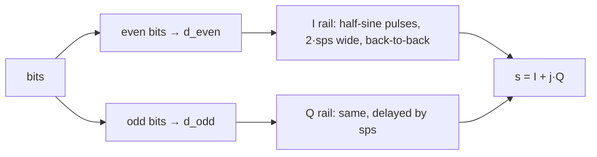

# MSK Modulation — Matched-Filter Implementation

MSK was added after the first batch of modulations (BPSK through 32APSK). Its
modulator and demodulator are slightly more involved than the others, because a
naive per-symbol correlator does **not** reach MSK's textbook performance. This
note explains the approach taken: MSK is implemented — both transmit and receive
— as **offset-QPSK with half-sine pulse shaping**, demodulated with a plain
per-rail matched filter. No Viterbi/MLSE decoder is used, and none is needed.

---

## What MSK is

MSK (minimum-shift keying) is continuous-phase FSK with modulation index
`h = 0.5`, carrying 1 bit per symbol. In the continuous-phase (CPFSK) view, the
baseband signal over bit period `n` is a pure phase ramp:

```
s[n·sps + k] = exp( j · ( phi_n + d_n · pi · k / (2·sps) ) )      k = 0 … sps-1

    d_n   = +1 for bit 0,  -1 for bit 1
    phi_n = phi_{n-1} + d_{n-1} · pi/2          (phase is continuous)
```

The envelope is constant (`|s| = 1`) and the phase moves by exactly `±pi/2` per
bit. Its defining advantage is that **correctly detected MSK has the same bit
error rate as BPSK**: `BER = 0.5·erfc(√(Eb/N0))`.

---

## Why a per-symbol correlator is not enough

The obvious receiver correlates each bit period against the two phase-ramp
hypotheses (`d_n = +1` vs `d_n = -1`). That receiver loses about **3 dB**
relative to BPSK, and the reason is fundamental, not a bug.

Over a *single* bit period the two MSK waveforms are nearly **orthogonal**, not
antipodal. Their correlation is:

```
<s+, s-> = Σ_k exp( j · pi · k / sps )      k = 0 … sps-1
```

which is almost purely imaginary — its real part is ≈ 0. Antipodal signalling
(correlation `-1`, as in BPSK) gives `BER = Q(√(2·Eb/N0))`; orthogonal
signalling (correlation `0`) gives only `BER = Q(√(Eb/N0))` — exactly the 3 dB
gap that was observed.

The information that distinguishes MSK's full performance from this 3 dB-worse
figure is spread across **two** bit periods. Any optimal MSK receiver must
therefore observe two bit periods per decision.

---

## Two ways to recover the missing 3 dB

| Approach | How it observes 2 bits | Cost |
|---|---|---|
| **Viterbi / MLSE** | 4-state phase trellis, add-compare-select, traceback | ~100 lines; trellis bookkeeping; hard to verify |
| **Offset-QPSK matched filter** | half-sine pulse spanning 2·sps samples per rail | ~25 lines; a dot product per rail symbol |

Both are optimal and both reach the BPSK error rate. This project uses the
**matched-filter** approach: it is far simpler, has no trellis state, and — as
shown below — incurs *exactly zero* discretisation loss.

---

## The key identity: MSK is offset-QPSK

MSK is *exactly* offset-QPSK whose pulse is a half-sine. In complex baseband:

```
s(t) = a_I(t) · cos(pi·t / 2T)  +  j · a_Q(t) · sin(pi·t / 2T)
```

with `a_I, a_Q ∈ {±1}` and the Q rail delayed by one bit period `T`. The
envelope is constant because the I and Q pulses are in quadrature:

```
|s(t)|² = a_I² · cos²(·)  +  a_Q² · sin²(·)  =  cos² + sin²  =  1
```

Crucially, in this view **each rail is an independent antipodal (BPSK) channel**.
A matched filter on each rail is therefore the optimal detector, and it
automatically observes the full 2-bit-period span — because each half-sine pulse
is `2·sps` samples wide.

---

## Transmitter — `sim/baseband.py::_msk_baseband`



Even-indexed bits drive the in-phase rail, odd-indexed bits the quadrature rail.
Each rail symbol is the half-sine pulse

```
pulse[k] = sin( pi · k / (2·sps) )      k = 0 … 2·sps-1
```

repeated back-to-back (`±1`-scaled). Because each rail only receives every
*other* bit, consecutive same-rail pulses are `2·sps` apart and exactly tile —
there is **zero inter-symbol interference by construction**, no convolution and
no RRC filter. The Q rail is offset by `sps` samples (the offset-QPSK delay).

`rolloff` and `filter_span` are accepted for interface compatibility but unused.

---

## Receiver — `sim/receiver.py::_msk_receive`

Each rail is matched-filtered independently with the same half-sine pulse:

```
y_I[j] = Σ_k  Re{ r[2j·sps + k] }      · pulse[k]      k = 0 … 2·sps-1
y_Q[j] = Σ_k  Im{ r[sps + 2j·sps + k] } · pulse[k]
```

The sign of each output is the rail bit (`y > 0 → bit 0`). The two rails are
then interleaved back into the bit stream (`bits[0::2]` from I, `bits[1::2]`
from Q). A residual 180° phase ambiguity is corrected the same way it is for the
other modulations: if measured BER > 0.5, every decision is inverted.

There is no trellis, no traceback, and no per-sample state — just one dot
product per rail symbol.

---

## Why this attains the BPSK error rate exactly

The matched-filter output for one rail symbol of amplitude `a = ±1` is

```
y = a · E_pulse  +  noise
```

where `E_pulse` is the pulse energy. For the half-sine pulse this energy is
**exactly `sps`** — not approximately:

```
Σ_{k=0}^{2·sps-1} sin²( pi·k / (2·sps) )
    = Σ ( 1 - cos(pi·k/sps) ) / 2
    = sps  -  (1/2)·Σ cos(pi·k/sps)
    = sps  -  0                        (the cosine sums to zero over a full period)
    = sps
```

With the test harness noise calibration `σ² = sps / (2·Es/N0)` per real
dimension, the filtered noise has variance `σ²·sps`, so:

```
BER = Q( E_pulse / √(σ²·sps) )
    = Q( sps / √(σ²·sps) )
    = Q( √(sps / σ²) )
    = Q( √(2·Es/N0) )
    = Q( √(2·Eb/N0) )                  (MSK carries 1 bit/symbol, so Es = Eb)
    = 0.5·erfc( √(Eb/N0) )             — the BPSK / theory curve
```

Because `E_pulse = sps` is exact, there is **no discretisation loss**: the
measured curve tracks the closed-form theory to within ~0.05 dB across the full
BER range (see `tests/plots/performance/theory_comparison.md`).

---

## Edge effect

The matched-filter window for a rail symbol is `2·sps` samples wide. For at most
**one** rail symbol — the last one on whichever rail extends past the end of the
signal — that window runs off the end and is clipped to a half-energy
observation. This costs nothing in the noiseless case (the sign is still
correct) and is statistically negligible for the test sizes used
(`n_sym ≥ 300`). All interior symbols use full `2·sps` windows.

---

## Differences from the OQPSK path

MSK and the existing `_oqpsk_baseband` both stagger two antipodal rails, but they
are not interchangeable:

| | OQPSK | MSK |
|---|---|---|
| Rail symbol duration | `sps` | `2·sps` |
| Q-rail offset | `sps/2` | `sps` |
| Pulse | RRC (spans many symbols) | half-sine, exactly `2·sps` wide |
| Bits per symbol | 2 | 1 |
| Envelope | not constant (RRC ringing) | constant |
| Filtering | `np.convolve` with RRC | direct tiled multiply, no convolution |

The half-sine pulse cannot simply be dropped into the OQPSK path: it is `2·sps`
wide, so it only tiles without overlap when same-rail symbols are `2·sps` apart.
The `2·sps` rail cadence and the half-sine pulse are a matched pair — together
they produce the constant envelope and the zero-ISI property.

---

## EVM

EVM is reported as `NaN` for MSK. EVM measures displacement from discrete
constellation points, and a constant-envelope continuous-phase signal has no
such points. The AWGN performance tests skip the EVM assertion for MSK
accordingly.
