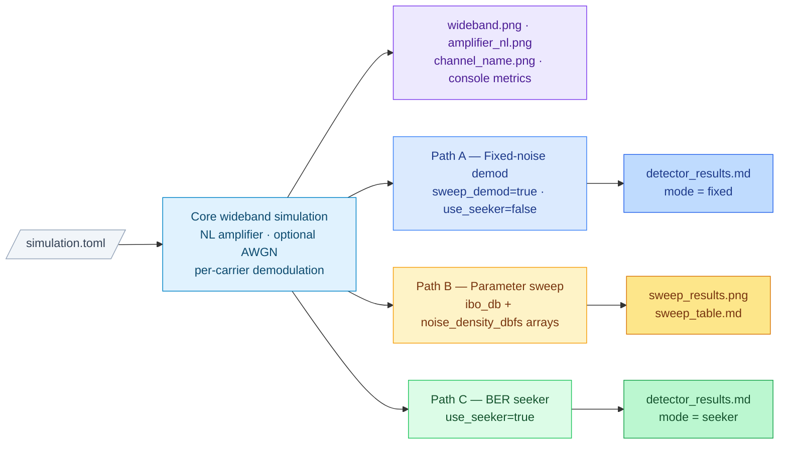

# Simulation Overview

This document describes the full execution flow of SO-WAT (Simulation Orchestrator –
Waveform Analysis Tool), the paths that activate depending on configuration, and the
output files produced by each path.

---

## 1. Architecture at a Glance



The three lower paths are **fully independent** of each other.  You can enable any
combination, any one alone, or none at all.

---

## 2. The Core Signal Chain (always runs)

Every simulation run begins here regardless of which optional paths are active.

### 2a. Per-carrier transmit baseband

For each **enabled** carrier (`enabled = true`):

1. **Bit generation** — random bits are drawn from a seeded PRNG.
2. **Modulation** — bits are mapped to complex symbols using the configured scheme
   (BPSK, QPSK, OQPSK, DBPSK, 8PSK, 16QAM, 16APSK, 32APSK).
3. **Pulse shaping** — symbols are shaped at the carrier's *native sample rate*
   (`sps × symbol_rate` Hz) with a root-raised-cosine (RRC) filter.
4. **Channel impairment** *(optional)* — if a `[carrier.channel]` block is present
   and `enabled = true`, the baseband signal is passed through a frequency-domain
   filter that adds:
   - Passband amplitude ripple: `1 + r·cos(π · ripple_cycles · f_norm)` in-band.
   - Phase nonlinearity: a polynomial curve up to `max_phase_dev_deg` degrees.

### 2b. Wideband composite formation

5. **Upsample** — each carrier is upsampled from its native rate to the common
   wideband `sample_rate` using an FFT overlap-and-add (OLA) Kaiser-windowed sinc
   filter.  The upsample factor `L = sample_rate / native_rate` must be a positive
   integer.
6. **Frequency-shift and scale** — each upsampled signal is multiplied by
   `e^{j 2π freq t}` to place it at its configured centre frequency, then scaled by
   `10^(power_db/20)`.
7. **Sum** — all shifted, scaled carriers are added into the composite wideband signal.

### 2c. Nonlinear amplifier

8. **Normalise** — the composite is normalised so its peak amplitude is 1.0, then
   the input-backoff level (`10^(-input_backoff_db/20)`) is applied as a drive factor.
9. **AM-AM / AM-PM** — the driven composite passes through the nonlinear amplifier
   model, which performs table interpolation to apply amplitude compression (AM-AM)
   and phase rotation (AM-PM) as a function of instantaneous envelope amplitude.

### 2d. Noise injection (optional)

10. **AWGN** — if `noise_density_dbfs` is set in `[wideband]`, complex Gaussian
    noise is added to the amplifier output.  Noise power = `10^(N₀/10) × sample_rate`.
    If not set, the noisy signal is identical to the post-NL signal.

### 2e. Per-carrier extraction and demodulation

Only carriers with `sweep_demod = true` are processed here.  Carriers with
`sweep_demod = false` (or the default, which is `false` in the main run) contribute
to the composite and NL loading but are **not** decoded.

For each demodulated carrier, three extractions are performed in parallel:

| Label | Source signal | Purpose |
|---|---|---|
| `bb_rx` | Pre-NL composite (after normalise/IBO, before amplifier) | Reference — no distortion |
| `nl_pure` | Post-NL, before noise | Distortion measurement |
| `nl_down` | Post-NL + noise | What the receiver actually sees |

Each extraction: downconvert (multiply by `e^{-j 2π freq t}`) → OLA downsample to
native rate → matched RRC filter → symbol decisions → BER + EVM.

**C/N/I decomposition** — `nl_pure` is projected onto `bb_rx` to isolate the
deterministic AM-AM/AM-PM gain change from true in-band intermodulation distortion.
The projection coefficient `α` = ⟨bb_rx, nl_pure⟩ / ‖bb_rx‖² separates:

- `sig` = `α · bb_rx` — the desired signal component
- `distortion` = `nl_pure − sig` — in-band intermodulation distortion (IMD)

This gives three figures of merit per carrier:

| Metric | Formula | Meaning |
|---|---|---|
| CNR (dB) | `P_sig / P_noise` | Carrier-to-noise ratio |
| CIR (dB) | `P_sig / P_distortion` | Carrier-to-IMD ratio |
| CNIR (dB) | `P_sig / (P_dist + P_noise)` | Combined carrier-to-noise+IMD |

**BER** is measured with phase-ambiguity resolution: all rotationally symmetric
orientations of the received constellation are tried and the minimum BER is returned.
This handles the constant phase offset introduced by AM-PM without requiring an
explicit carrier recovery loop.

---

## 3. Carrier Control Flags

Each `[[carrier]]` block supports three flags that control how a carrier participates:

| Flag | Default | Effect |
|---|---|---|
| `enabled` | `true` | Excludes the carrier entirely when `false` |
| `sweep_demod` | `false` | Enables per-carrier demodulation (BER/EVM/CNR/CIR/CNIR) |
| `use_seeker` | `false` | Routes this carrier through the BER seeker instead of a single fixed-noise demod |

A carrier can be in the wideband composite without being demodulated (`sweep_demod =
false`).  This is the normal choice for carriers that exist only to provide realistic
NL loading (interference, adjacent channels, etc.).

---

## 4. Execution Paths

### Path A — Fixed-noise demodulation

**Activates when:** `sweep_demod = true` and `use_seeker = false` on one or more
carriers.

The demodulation results from the core run (Step 2e above) are used directly.  The
noise level is whatever is set in `[wideband] noise_density_dbfs`.  After the run,
effective Eb/N0 is computed from the CNIR measurement:

```
Eff Eb/N0 = CNIR_dB + 10·log10(sps / bits_per_symbol)
```

This is compared to the theoretical Eb/N0 required to achieve the measured BER in
pure AWGN, giving the **implementation loss** (IL = Eff Eb/N0 − Theory Eb/N0).

**Output:** one row per carrier appended to `detector_results.md` with `mode = fixed`.

---

### Path B — Parameter sweep

**Activates when:** `[sweep]` contains both `ibo_db` and `noise_density_dbfs` arrays.

The full wideband simulation (Steps 2a–2e) is re-run at every point on the
IBO × noise grid.  Each grid point is an independent simulation; the results are not
related to the core run or to each other.

- **IBO axis** — overrides `[amplifier] input_backoff_db` at each point.
- **Noise axis** — overrides `[wideband] noise_density_dbfs` at each point.
- **Which carriers are demodulated** — all carriers with `sweep_demod = true`
  (note: the default inside the sweep is `true`, unlike the main run where it is `false`).
- The sweep and the seeker are **independent** — the sweep uses explicit noise levels
  from the config; the seeker adapts the noise level to hit a BER target.  Enabling
  one does not affect the other.

**Outputs:**

| File | Content |
|---|---|
| `sweep_results.png` | BER, EVM (%), and CNR/CIR/CNIR (dB) vs IBO; one column per metric, one row per demodulated carrier; noise level shown as a colour gradient |
| `sweep_table.md` | Markdown report: config summary, per-carrier performance ranges, and the full IBO × noise results table |

---

### Path C — BER seeker

**Activates when:** `sweep_demod = true` and `use_seeker = true` on one or more
carriers.

Instead of demodulating at the fixed noise level from `[wideband]`, the seeker runs
a bisection search over `noise_density_dbfs` to find the noise floor that produces a
user-specified target BER.  The IBO used is always `[amplifier] input_backoff_db`
(not swept).

The seeker sequence for one carrier:

1. **Bracket check** — run the simulation at `noise_lo_dbfs` and `noise_hi_dbfs`
   (from the per-carrier `[seeker]` sub-dict, or global defaults) to confirm the
   target BER lies within the bracket.  Raises an error if it does not.
2. **Bisection** — up to `max_iter` iterations (default 20).  The bit budget starts
   low and doubles every two steps so early iterations are fast and final iterations
   are statistically sound.  The search exits early if the bracket narrows below
   0.05 dB.
3. **Final measurement** — the converged noise level is re-simulated with
   `n_final_seeds` independent random seeds (default 5), pooling all trials to
   achieve the statistical confidence specified by `confidence` and `ber_accuracy`.
4. **Implementation loss** — effective Eb/N0 is derived from the CNIR at the
   converged point and compared to the theory curve, same as Path A.

Per-carrier seeker parameters live under `[carrier.seeker]`:

| Key | Default | Meaning |
|---|---|---|
| `target_ber` | 0.01 | BER the seeker aims for |
| `confidence` | 0.95 | Confidence level for the BER CI |
| `ber_accuracy` | 0.005 | Half-width of the CI in absolute BER |
| `noise_lo_dbfs` | −160 | Quietest end of the search bracket |
| `noise_hi_dbfs` | −80 | Noisiest end of the search bracket |

**Output:** one row per carrier appended to `detector_results.md` with `mode = seeker`,
including the 95 % confidence interval on the measured BER and the total bit count
used in the final measurement.

---

## 5. Output Files Summary

| File (under `output_dir`) | Produced by | Always? |
|---|---|---|
| `wideband.png` | Core run | Yes — if `output.wideband` is set |
| `amplifier_nl.png` | Config tables (no sim needed) | Yes — if `output.nl_tables` is set |
| `channel_<name>.png` | Per-carrier with `[carrier.channel]` | If carrier has a channel block with `plot` key |
| Console metrics table | Core run | Yes — for all demodulated carriers |
| `sweep_results.png` | Path B (sweep) | Only if both `ibo_db` and `noise_density_dbfs` sweep arrays are present |
| `sweep_table.md` | Path B (sweep) | Only if sweep is active and `output.sweep_table` is set |
| `detector_results.md` | Paths A and/or C | Only if at least one carrier has `sweep_demod = true` |

`detector_results.md` collects results from both fixed-noise demod (Path A) and
seeker (Path C) in one table.  If both are active, they each contribute rows to the
same file.

---

## 6. Example Configurations

### Minimal — wideband PSD and amplifier plots only

```toml
[[carrier]]
name = "beacon"
sweep_demod = false   # default; included in composite, not decoded
use_seeker  = false   # default
```

No sweep arrays, no `sweep_demod = true` carriers → only `wideband.png` and
`amplifier_nl.png` are produced.

---

### Fixed-noise BER measurement

```toml
[wideband]
noise_density_dbfs = -160

[[carrier]]
name = "link"
sweep_demod = true
use_seeker  = false
```

Runs the core simulation once at the configured noise level.  Produces
`wideband.png`, `amplifier_nl.png`, and `detector_results.md` (mode = fixed).

---

### IBO and noise sweep

```toml
[sweep]
ibo_db             = [0, 3, 6]
noise_density_dbfs = [-100, -90, -80]

[[carrier]]
name = "link"
sweep_demod = true
use_seeker  = false
```

Runs 9 grid points.  Produces `wideband.png`, `amplifier_nl.png`,
`sweep_results.png`, and `sweep_table.md`.  No seeker → no `detector_results.md`.

---

### Adaptive BER seeking

```toml
[wideband]
noise_density_dbfs = -160   # used for core run; seeker will adapt this

[[carrier]]
name = "link"
sweep_demod = true
use_seeker  = true

[carrier.seeker]
target_ber    = 0.01
noise_lo_dbfs = -160
noise_hi_dbfs = -80
```

Runs the core simulation, then the seeker bisects to find the noise level that gives
BER ≈ 0.01.  Produces `wideband.png`, `amplifier_nl.png`, and `detector_results.md`
(mode = seeker).

---

### Sweep and seeker together

The sweep and seeker can run simultaneously.  A typical use case: some carriers
provide an IBO/noise sensitivity surface (sweep), while the primary link carrier
uses the seeker to quantify implementation loss at the nominal IBO.

```toml
[sweep]
ibo_db             = [0, 3, 6]
noise_density_dbfs = [-100, -90, -80]

[[carrier]]
name = "interferer"
sweep_demod = true    # included in sweep surface
use_seeker  = false

[[carrier]]
name = "link"
sweep_demod = true    # included in sweep surface AND in seeker
use_seeker  = true
```

Both paths run independently.  `sweep_results.png` / `sweep_table.md` cover the full
grid; `detector_results.md` has a seeker row for `link`.
