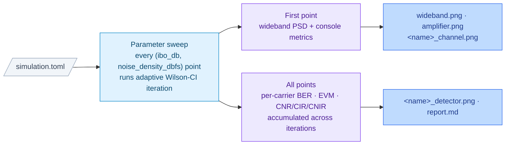

# Simulation Overview

This document describes the full execution flow of SO-WAT (Simulation Orchestrator –
Waveform Analysis Tool), the paths that activate depending on configuration, and the
output files produced by each path.

---

## 1. Architecture at a Glance



The sweep is the sole simulation driver.  A 1×1 sweep is a single-point run; a
larger grid fans the full chunk pipeline out across every (IBO, noise) combination.

---

## 2. The Core Signal Chain (always runs)

Every simulation run begins here regardless of which optional paths are active.

### 2a. Per-carrier transmit baseband

For each **enabled** carrier (`enabled = true`):

1. **Bit generation** — random bits are drawn from a seeded PRNG.
2. **Modulation** — bits are mapped to complex symbols using the configured scheme
   (BPSK, QPSK, OQPSK, DBPSK, 8PSK, 16QAM, 16APSK, 32APSK).
3. **Pulse shaping** — symbols are shaped at the carrier's *native sample rate*
   (`sps × symbol_rate` Hz) with a root-raised-cosine (RRC) filter.
4. **Channel impairment** *(optional)* — if a `[carrier.channel]` block is present
   and `enabled = true`, the baseband signal is passed through a frequency-domain
   filter that adds:
   - Passband amplitude ripple: `1 + r·cos(π · ripple_cycles · f_norm)` in-band.
   - Phase nonlinearity: a polynomial curve up to `max_phase_dev_deg` degrees.
4b. **Phase noise** *(optional, per carrier)* — if the carrier has a
   `[carrier.phase_noise]` block with `enabled = true`, its baseband is
   multiplied by `exp(j·φ[n])` where `φ[n]` is a real Gaussian process whose
   PSD follows the user's `(offset_hz, dbc_per_hz)` mask (log-log
   interpolation, flat extrapolation past either end).  Applied at the
   carrier's native sample rate, immediately after the channel-impairment
   filter, so the noise lives in the carrier's own baseband bandwidth before
   the OLA upsample.  Each carrier carries its own mask, so independent
   oscillator chains on different links can be modelled separately.

### 2b. Wideband composite formation

5. **Upsample** — each carrier is upsampled from its native rate to the common
   wideband `sample_rate` using an FFT overlap-and-add (OLA) Kaiser-windowed sinc
   filter.  The upsample factor `L = sample_rate / native_rate` must be a positive
   integer.
6. **Frequency-shift and scale** — each upsampled signal is multiplied by
   `e^{j 2π freq t}` to place it at its configured centre frequency, then scaled by
   `10^(power_db/20)`.
7. **Sum** — all shifted, scaled carriers are added into the composite wideband signal.

### 2c. Nonlinear amplifier

8. **Normalise** — the composite is scaled by its analytical RMS, then the
   per-point input-backoff level (`10^(-ibo_db/20)`) is applied as a drive factor.
9. **AM-AM / AM-PM** — the driven composite passes through the nonlinear amplifier
   model, which performs table interpolation to apply amplitude compression (AM-AM)
   and phase rotation (AM-PM) as a function of instantaneous envelope amplitude.

### 2d. Noise injection (optional)

10. **AWGN** — complex Gaussian noise is added to the amplifier output at the
    per-point `noise_density_dbfs` value.  Noise power = `10^(N₀/10) × sample_rate`.

### 2e. Per-carrier extraction and demodulation

Only carriers with `sweep_demod = true` are processed here.  Carriers with
`sweep_demod = false` (or the default, which is `false` in the main run) contribute
to the composite and NL loading but are **not** decoded.

For each demodulated carrier, three extractions are performed in parallel:

| Label | Source signal | Purpose |
|---|---|---|
| `bb_rx` | Pre-NL composite (after normalise/IBO, before amplifier) | Reference — no distortion |
| `nl_pure` | Post-NL, before noise | Distortion measurement |
| `nl_down` | Post-NL + noise | What the receiver actually sees |

Each extraction: downconvert (multiply by `e^{-j 2π freq t}`) → OLA downsample to
native rate → matched RRC filter → symbol decisions → BER + EVM.

**C/N/I decomposition** — `nl_pure` is projected onto `bb_rx` to isolate the
deterministic AM-AM/AM-PM gain change from true in-band intermodulation distortion.
The projection coefficient `α` = ⟨bb_rx, nl_pure⟩ / ‖bb_rx‖² separates:

- `sig` = `α · bb_rx` — the desired signal component
- `distortion` = `nl_pure − sig` — in-band intermodulation distortion (IMD)

This gives three figures of merit per carrier:

| Metric | Formula | Meaning |
|---|---|---|
| CNR (dB) | `P_sig / P_noise` | Carrier-to-noise ratio |
| CIR (dB) | `P_sig / P_distortion` | Carrier-to-IMD ratio |
| CNIR (dB) | `P_sig / (P_dist + P_noise)` | Combined carrier-to-noise+IMD |

**BER** is measured with phase-ambiguity resolution: all rotationally symmetric
orientations of the received constellation are tried and the minimum BER is returned.
This handles the constant phase offset introduced by AM-PM without requiring an
explicit carrier recovery loop.

---

## 3. Carrier Control Flags

Each `[[carrier]]` block supports two flags that control how a carrier participates:

| Flag | Default | Effect |
|---|---|---|
| `enabled` | `true` | Excludes the carrier entirely when `false` |
| `sweep_demod` | `false` | Enables per-carrier demodulation (BER/EVM/CNR/CIR/CNIR) |

A carrier can be in the wideband composite without being demodulated (`sweep_demod =
false`).  This is the normal choice for carriers that exist only to provide realistic
NL loading (interference, adjacent channels, etc.).

---

## 4. Execution model

The sweep is the sole simulation driver. Every (IBO, noise) point listed in
`[sweep]` is simulated end-to-end via the chunk pipeline above (Steps 2a–2e).
A single-point "config" is simply a 1×1 sweep — there is no separate fixed-noise
mode.

Each grid point is iterated adaptively: the chunk pipeline reruns with
independent seeds until the Wilson CI half-width on BER meets a stopping rule
(with at least `min_errors` observed), or `max_iterations` is hit. Per-carrier
`num_symbols` / `num_frames` for one iteration are derived from
`[simulation].max_block_size_samples`.

The stopping rule supports an either-or test:

```
hw ≤ target_ci_half_width
OR  (target_ci_relative is set AND ber > 0 AND hw / ber ≤ target_ci_relative)
```

The absolute target is always active; the relative target (e.g. `0.01` ≡ ±1%
of BER) is opt-in and lets noisy points exit in a handful of iterations without
forcing a tiny absolute interval that only matters at low BER.  See
[GUIDE.md § 8 "Sweep mode"](GUIDE.md#8-sweep-mode) for the iteration-sizing
formula and a worked example, and
[memory/technical_notes.md § "Adaptive iteration"](../memory/technical_notes.md)
for the full design rationale.

- **IBO axis** — `[sweep].ibo_db` (list, ≥1 value).  Each value sets the drive
  level at that grid point.
- **Noise axis** — `[sweep].noise_density_dbfs` (list, ≥1 value).  Each value
  sets the AWGN PSD at that grid point.
- **Demodulated carriers** — all carriers with `sweep_demod = true`.
- **PSD plot point** — the first grid point's first iteration's wideband
  composite feeds `wideband.png`.

For each demodulated carrier at each grid point, effective Eb/N0 is computed
from the (iteration-averaged) CNIR measurement.  CNIR is reported in the
symbol-rate (matched-filter) bandwidth, so CNIR = Es/N0 directly; the per-bit
conversion is:

```
Eff Eb/N0 = CNIR_dB − 10·log10(bits_per_symbol)
```

For BPSK (bps = 1) Eff Eb/N0 is identical to CNIR.

This is compared to the theoretical Eb/N0 required to achieve the measured BER
in pure AWGN, giving the **implementation loss** (IL = Eff Eb/N0 − Theory Eb/N0).
Every grid point becomes one row per demodulated carrier in `report.md`, with
columns including the iteration count, accumulated bit/error counts, and the
Wilson CI half-width.

---

## 5. Output Files Summary

All filenames are fixed (no per-file overrides). `<name>` is the carrier's
`name` with spaces replaced by underscores. The `[output].plots` boolean
(default `true`) gates every image output; `report.md` is always written
whenever any carrier has `sweep_demod = true`.

| File (under `output_dir`) | Produced by | Gated by |
|---|---|---|
| `wideband.png` | First sweep point's first iteration | `[output].plots` |
| `amplifier.png` | Config tables (no sim needed) | `[output].plots` |
| `<name>_channel.png` | Per-carrier with `[carrier.channel]` block | `[output].plots` |
| `<name>_phase_noise.png` | Per-carrier with enabled `[carrier.phase_noise]` block; mask + cumulative RMS phase | `[output].plots` |
| `<name>_detector.png` | Per-`sweep_demod` carrier; 2×3 grid (vs IBO and vs CNR) | `[output].plots` |
| `<name>_detector_<panel>.png` | Same data, one PNG per panel (`ber_vs_ibo`, `evm_vs_ibo`, `db_vs_ibo`, `ber_vs_cnr`, `evm_vs_cnr`, `db_vs_cnr`) | `[output].plots` |
| Console metrics table | First sweep point's first iteration | Always |
| `report.md` | Full sweep, one row per (carrier, IBO, noise) | Always (when any `sweep_demod`) |

---

## 6. Example Configurations

### Single point — PSD and amplifier plots, no BER

```toml
[sweep]
sample_rate        = 16
ibo_db             = [3]
noise_density_dbfs = [-160]

[[carrier]]
name = "beacon"
sweep_demod = false   # default; included in composite, not decoded
```

A 1×1 sweep with no demod carriers → only `wideband.png` and `amplifier.png`
are produced. No `report.md` (nothing was demodulated), no `<name>_detector.png`
(no `sweep_demod = true` carrier).

---

### Single-point BER measurement

```toml
[sweep]
sample_rate        = 16
ibo_db             = [3]
noise_density_dbfs = [-160]

[[carrier]]
name = "link"
sweep_demod = true
```

Runs one grid point (iterated until the CI target is met). Produces
`wideband.png`, `amplifier.png`, `link_detector.png`, and a one-row
`report.md`.

---

### IBO and noise sweep

```toml
[sweep]
sample_rate        = 16
ibo_db             = [0, 3, 6]
noise_density_dbfs = [-100, -90, -80]

[[carrier]]
name = "link"
sweep_demod = true
```

Runs 9 grid points, each adaptively iterated. Produces `wideband.png` (from
the first point's first iteration), `amplifier.png`, `link_detector.png` (2×3
grid summarising all 9 points), and a 9-row `report.md`.
